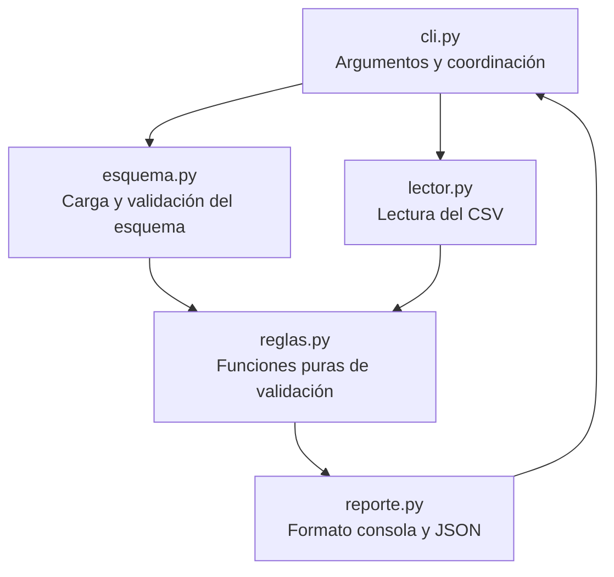

# Design Document — validador-csv

## Overview

El validador-csv es una herramienta de línea de comandos que comprueba la calidad de un
archivo CSV antes de usarlo en analítica. El diseño sigue una separación estricta de
responsabilidades en seis módulos, cada uno con una única razón de cambio. La herramienta
usa exclusivamente la biblioteca estándar de Python 3.11 en producción y `pytest` como
única dependencia de desarrollo.

El flujo de ejecución es lineal y determinista:

```
CLI → esquema → lector → reglas → reporte → CLI (código de salida)
```

Los datos fluyen hacia adelante; ningún módulo llama al anterior. Los errores de I/O
terminan en el CLI con código 2; los problemas de calidad de datos producen hallazgos y
código 1; la ausencia de problemas produce código 0.

---

## Architecture



### Principios de arquitectura

- **Separación total**: lectura, reglas y presentación en módulos distintos. Ningún módulo
  importa de otro salvo el flujo definido arriba.
- **Funciones puras en `reglas.py`**: reciben datos, devuelven listas de `Hallazgo`. Sin
  estado mutable, sin I/O.
- **I/O confinado**: `esquema.py`, `lector.py` y `reporte.py` hacen I/O. `cli.py` los
  coordina. `reglas.py` nunca toca el sistema de archivos.
- **`print` y `sys.exit` solo en `cli.py`**: el resto de módulos levanta excepciones o
  devuelve valores.
- **Errores explícitos**: se usan excepciones específicas (`ValueError`, `OSError`) con
  mensajes descriptivos. Prohibido el `except` genérico silencioso.

---

## Components and Interfaces

### `src/validador/__init__.py`

Vacío o con versión. No exporta nada por defecto.

---

### `src/validador/esquema.py`

Carga el archivo JSON de esquema y devuelve una representación tipada.

```python
from dataclasses import dataclass
from typing import Optional

TIPOS_VALIDOS = {"entero", "decimal", "fecha", "texto"}
FORMATO_FECHA_DEFAULT = "%Y-%m-%d"
DELIMITADOR_DEFAULT = ","

@dataclass(frozen=True)
class ColumnaEsquema:
    nombre: str
    tipo: str                        # "entero" | "decimal" | "fecha" | "texto"
    obligatoria: bool
    formato: Optional[str] = None    # solo para tipo "fecha"

@dataclass(frozen=True)
class Esquema:
    columnas: tuple[ColumnaEsquema, ...]
    clave_unica: tuple[str, ...]
    delimitador: str

def cargar_esquema(ruta: str) -> Esquema:
    """Carga y valida el esquema JSON en la ruta indicada.

    Levanta OSError si el archivo no existe.
    Levanta ValueError si el JSON está mal formado, falta el campo 'columnas',
    o algún tipo de columna no pertenece a {'entero', 'decimal', 'fecha', 'texto'}.
    """

def _validar_columna(datos: dict) -> ColumnaEsquema:
    """Valida y construye una ColumnaEsquema desde un dict JSON.

    Levanta ValueError si el tipo es desconocido.
    """
```

**Decisiones de diseño:**
- `ColumnaEsquema` y `Esquema` son dataclasses inmutables (`frozen=True`) para evitar
  mutación accidental en el pipeline.
- El campo `formato` de `ColumnaEsquema` lleva el valor por defecto ya resuelto (`%Y-%m-%d`)
  en la fase de carga, no en la de validación, para que `reglas.py` no necesite conocer el
  default.
- `clave_unica` por defecto es una tupla vacía cuando el campo no está en el esquema.

---

### `src/validador/lector.py`

Lee el CSV y entrega una representación iterada de cabecera y filas numeradas.

```python
from dataclasses import dataclass

@dataclass(frozen=True)
class FilaCSV:
    numero: int                      # numeración Excel: cabecera=1, primer dato=2
    campos: dict[str, str]           # {nombre_columna: valor_celda}

def leer_csv(ruta: str, delimitador: str) -> tuple[list[str], list[FilaCSV]]:
    """Lee el CSV y devuelve (cabecera, filas).

    cabecera: lista de nombres de columna tal como aparecen en la fila 1.
    filas: lista de FilaCSV con numeración Excel (primer dato = fila 2).
    
    Lee con encoding='utf-8-sig' para eliminar el BOM de Excel.
    Levanta OSError si el archivo no existe o no puede leerse.
    Devuelve (cabecera, []) si el CSV no contiene filas de datos.
    """
```

**Decisiones de diseño:**
- `FilaCSV.campos` es un dict `str→str`; la conversión de tipos ocurre en `reglas.py`, no
  aquí. El lector no sabe nada del esquema.
- La numeración Excel se calcula en el lector: `numero = indice_en_lista + 2`. Así todos
  los módulos posteriores usan números de fila correctos sin conversión.
- Columnas extra del CSV (no definidas en el esquema) se incluyen en `campos` sin
  modificación; `reglas.py` las ignora.

---

### `src/validador/reglas.py`

Cuatro funciones puras, una por regla. Cada una recibe los datos necesarios y devuelve
`list[Hallazgo]`. No hacen I/O.

```python
from dataclasses import dataclass
from validador.esquema import Esquema, ColumnaEsquema
from validador.lector import FilaCSV

@dataclass(frozen=True)
class Hallazgo:
    fila: int
    columna: str
    regla: str      # "columna_faltante" | "tipo_invalido" | "vacio_obligatorio" | "duplicado"
    valor: str
    mensaje: str

def verificar_columnas_faltantes(
    cabecera: list[str],
    esquema: Esquema,
) -> list[Hallazgo]:
    """Regla 1: detecta columnas obligatorias ausentes en la cabecera.

    Devuelve un Hallazgo por cada columna obligatoria del esquema ausente en la cabecera.
    fila=1, columna=nombre_ausente, valor="".
    Si no hay columnas faltantes, devuelve lista vacía.
    """

def verificar_tipos(
    filas: list[FilaCSV],
    esquema: Esquema,
) -> list[Hallazgo]:
    """Regla 2: detecta valores con tipo incorrecto en columnas presentes.

    Para cada celda no vacía cuyo tipo no coincide con el esquema, genera tipo_invalido.
    Las celdas vacías (obligatorias o no) no generan tipo_invalido aquí; eso lo maneja
    verificar_vacios.
    Solo procesa columnas definidas en el esquema que existen en la fila.
    """

def verificar_vacios(
    filas: list[FilaCSV],
    esquema: Esquema,
) -> list[Hallazgo]:
    """Regla 3: detecta celdas vacías en columnas obligatorias.

    Una celda se considera vacía si su valor es la cadena vacía o compuesta solo de
    espacios (str.strip() == "").
    Solo genera vacio_obligatorio; nunca tipo_invalido.
    """

def verificar_duplicados(
    filas: list[FilaCSV],
    esquema: Esquema,
) -> list[Hallazgo]:
    """Regla 4: detecta filas con clave única duplicada.

    La clave es la concatenación de valores de las columnas en esquema.clave_unica.
    Las filas con algún valor vacío en la clave se omiten sin generar hallazgo.
    El campo valor del hallazgo contiene los valores de la clave concatenados con '|'.
    El campo mensaje incluye el número de fila de la primera aparición.
    """

# Funciones auxiliares privadas (no forman parte de la interfaz pública):

def _es_entero_valido(valor: str) -> bool:
    """Acepta solo cadenas que representen un entero sin decimales ni espacios."""

def _es_decimal_valido(valor: str) -> bool:
    """Acepta decimales con punto como separador, sin espacios."""

def _es_fecha_valida(valor: str, formato: str) -> bool:
    """Acepta cadenas que coincidan exactamente con el formato via datetime.strptime."""
```

**Decisiones de diseño:**
- `verificar_tipos` no llama a `verificar_vacios` ni viceversa. La coordinación de que
  "celda vacía en obligatoria → solo vacio_obligatorio, nunca tipo_invalido" se logra por
  contrato: `verificar_tipos` salta las celdas vacías; `verificar_vacios` solo genera su
  propio tipo.
- `_es_entero_valido` usa una expresión regular o `int()` con comprobación de que no haya
  punto ni espacios, no `float()` que aceptaría `"10.0"`.
- `_es_decimal_valido` usa `decimal.Decimal` de la biblioteca estándar para precisión.
- `_es_fecha_valida` usa `datetime.strptime` y verifica que no queden caracteres sobrantes.
- Ninguna función aquí usa `print`, `open`, ni `sys`.

---

### `src/validador/reporte.py`

Formatea los hallazgos para consola y, opcionalmente, escribe el reporte JSON.

```python
from validador.reglas import Hallazgo

TIPOS_REGLA_ORDEN = ["columna_faltante", "tipo_invalido", "vacio_obligatorio", "duplicado"]

def formatear_consola(
    ruta_csv: str,
    total_filas: int,
    hallazgos: list[Hallazgo],
) -> str:
    """Devuelve el texto completo del reporte para consola.

    Incluye resumen (total de filas, recuento por tipo) y, si hay hallazgos,
    la sección de detalle ordenada ascendentemente por número de fila.
    Los tipos con recuento 0 no aparecen en el resumen.
    Si no hay hallazgos, incluye la línea 'Sin hallazgos'.
    No imprime nada; devuelve str para que cli.py lo imprima.
    """

def escribir_json(
    ruta_salida: str,
    ruta_csv: str,
    ruta_esquema: str,
    total_filas: int,
    hallazgos: list[Hallazgo],
) -> None:
    """Escribe el reporte JSON en ruta_salida.

    Estructura exacta del JSON de salida:
    {
      "archivo": "<ruta_csv>",
      "esquema": "<ruta_esquema>",
      "total_filas": <int>,
      "total_hallazgos": <int>,
      "hallazgos": [{"fila": int, "columna": str, "regla": str, "valor": str, "mensaje": str}]
    }

    Sobrescribe el archivo si ya existe.
    Levanta OSError si el directorio destino no existe.
    No usa print; los errores se propagan al cli.py.
    """
```

**Decisiones de diseño:**
- `formatear_consola` devuelve `str` (no imprime). Así es testeable sin capturar stdout.
- `escribir_json` usa `json.dumps` con `ensure_ascii=False` para preservar caracteres
  UTF-8 en valores (p. ej. `"Ferretería Central"`).
- El orden de hallazgos en el JSON sigue el orden de la lista recibida (ya ordenada por
  fila desde `cli.py`).

---

### `src/validador/cli.py`

Punto de entrada. Parsea argumentos, coordina módulos y gestiona códigos de salida.

```python
import sys
import argparse
from validador.esquema import cargar_esquema
from validador.lector import leer_csv
from validador.reglas import (
    verificar_columnas_faltantes,
    verificar_tipos,
    verificar_vacios,
    verificar_duplicados,
    Hallazgo,
)
from validador.reporte import formatear_consola, escribir_json

def main() -> None:
    """Punto de entrada principal del validador CSV.

    Parsea los argumentos de línea de comandos, ejecuta el pipeline de validación
    y termina con el código de salida apropiado (0, 1 o 2).
    """

def _construir_parser() -> argparse.ArgumentParser:
    """Construye y devuelve el parser de argumentos."""

def _ejecutar_validacion(
    ruta_csv: str,
    ruta_esquema: str,
    ruta_salida_json: str | None,
) -> int:
    """Ejecuta el pipeline completo y devuelve el código de salida (0, 1 o 2).

    Captura OSError y ValueError de los módulos inferiores, los imprime en stderr
    y devuelve código 2. No llama a sys.exit directamente.
    """
```

**Decisiones de diseño:**
- `main()` solo llama a `_ejecutar_validacion()` y a `sys.exit()`. Esto permite testear
  `_ejecutar_validacion` sin que los tests intercepten `sys.exit`.
- Los mensajes de error van a `sys.stderr` (no `stdout`) para no contaminar el reporte.
- El orden de validación en `_ejecutar_validacion`:
  1. `cargar_esquema` → si falla: stderr + retorna 2
  2. `leer_csv` → si falla: stderr + retorna 2
  3. `verificar_columnas_faltantes` → si hay hallazgos: no ejecutar reglas 2-4
  4. Si no hay faltantes: `verificar_tipos` + `verificar_vacios` + `verificar_duplicados`
  5. Ordenar todos los hallazgos por `fila`
  6. `formatear_consola` → imprimir en stdout
  7. Si `--salida-json`: `escribir_json` → si falla: stderr + retorna 2
  8. Retornar 0 si no hay hallazgos, 1 si los hay

---

### `src/validador/__main__.py`

```python
from validador.cli import main

if __name__ == "__main__":
    main()
```

Permite la invocación `python -m validador`.

---

## Data Models

### Flujo de datos entre módulos

```
                    str (ruta)
cli.py ──────────────────────────→ esquema.py
                                         │
                                         ▼
                                      Esquema
                                    (dataclass)
                                         │
cli.py ──────────────────────────→ lector.py
           str (ruta), str (delimitador)  │
                                         ▼
                               list[str] (cabecera)
                               list[FilaCSV]
                                         │
                  Esquema ───────→ reglas.py
                  cabecera ──────→       │
                  list[FilaCSV] ─→       ▼
                                  list[Hallazgo]
                                         │
                               ──→ reporte.py
                    str (rutas)          │
                    int (total_filas)    ▼
                                    str (consola)
                                    archivo JSON
```

### Modelo de datos central

```python
@dataclass(frozen=True)
class Hallazgo:
    fila:    int    # número de fila Excel (cabecera=1, primer dato=2)
    columna: str    # nombre de la columna afectada
    regla:   str    # "columna_faltante" | "tipo_invalido" | "vacio_obligatorio" | "duplicado"
    valor:   str    # valor encontrado (cadena vacía si no aplica)
    mensaje: str    # descripción legible del problema
```

### Modelo del esquema

```python
@dataclass(frozen=True)
class ColumnaEsquema:
    nombre:     str
    tipo:       str            # "entero" | "decimal" | "fecha" | "texto"
    obligatoria: bool
    formato:    Optional[str]  # para "fecha"; ya lleva el default "%Y-%m-%d"

@dataclass(frozen=True)
class Esquema:
    columnas:     tuple[ColumnaEsquema, ...]
    clave_unica:  tuple[str, ...]
    delimitador:  str                          # default ","
```

### Modelo de fila CSV

```python
@dataclass(frozen=True)
class FilaCSV:
    numero: int           # número de fila Excel
    campos: dict[str, str]  # {columna: valor_raw_string}
```

---

## Correctness Properties

*Una propiedad es una característica o comportamiento que debe cumplirse en todas las
ejecuciones válidas del sistema — esencialmente, un enunciado formal sobre lo que el
sistema debe hacer. Las propiedades sirven de puente entre las especificaciones legibles
por humanos y las garantías de corrección verificables automáticamente.*

---

### Property 1: El delimitador del esquema se respeta fielmente

*Para cualquier* carácter de delimitador `d` definido en el esquema, la función
`cargar_esquema` devuelve un `Esquema` cuyo campo `delimitador` es exactamente `d`. Si el
esquema no define el campo, el delimitador devuelto es `","`.

**Validates: Requirements 1.3**

---

### Property 2: Tipos desconocidos en el esquema son rechazados

*Para cualquier* cadena que no pertenezca al conjunto
`{"entero", "decimal", "fecha", "texto"}`, usarla como tipo de columna en el esquema hace
que `cargar_esquema` levante `ValueError`.

**Validates: Requirements 1.4**

---

### Property 3: La numeración de filas es consistente con Excel

*Para cualquier* CSV con `N` filas de datos (N ≥ 0), la lista de `FilaCSV` devuelta por
`leer_csv` tiene exactamente `N` elementos, y el campo `numero` del elemento en la posición
`i` (base 0) es `i + 2`.

**Validates: Requirements 2.3**

---

### Property 4: El lector elimina el BOM de Excel

*Para cualquier* CSV cuyo contenido sea idéntico salvo por la presencia o ausencia del
BOM (`\ufeff`), la cabecera devuelta por `leer_csv` es la misma — el nombre de la primera
columna no comienza con `\ufeff`.

**Validates: Requirements 2.2**

---

### Property 5: Las columnas faltantes se detectan todas y solo ellas

*Para cualquier* subconjunto no vacío `F` de columnas obligatorias del esquema que estén
ausentes en la cabecera del CSV, `verificar_columnas_faltantes` devuelve exactamente
`|F|` hallazgos de tipo `columna_faltante`, uno por cada columna de `F`, con `fila=1`.

**Validates: Requirements 3.1**

---

### Property 6: La detección de faltantes bloquea las demás reglas

*Para cualquier* CSV con al menos una columna obligatoria faltante, el pipeline completo
no produce ningún hallazgo de tipo `tipo_invalido`, `vacio_obligatorio` ni `duplicado`.

**Validates: Requirements 3.2**

---

### Property 7: Las columnas extra en la cabecera no generan hallazgos

*Para cualquier* CSV que contenga columnas adicionales no definidas en el esquema (además
de todas las obligatorias), no se genera ningún hallazgo de tipo `columna_faltante` ni de
ningún otro tipo por esas columnas extra.

**Validates: Requirements 3.4**

---

### Property 8: La comparación de nombres de columna es sensible a mayúsculas

*Para cualquier* columna obligatoria del esquema con nombre `n`, si la cabecera del CSV
contiene una columna cuyo nombre difiere de `n` únicamente en capitalización (p. ej.
`"Fecha"` vs `"fecha"`), se genera un hallazgo `columna_faltante` para `n`.

**Validates: Requirements 3.5**

---

### Property 9: Valores inválidos generan exactamente un hallazgo de tipo

*Para cualquier* fila y columna con un valor no vacío que no puede convertirse al tipo
definido en el esquema, `verificar_tipos` genera exactamente un hallazgo `tipo_invalido`
para esa celda, y no genera ningún hallazgo para celdas que sí son válidas.

**Validates: Requirements 4.1**

---

### Property 10: El tipo entero rechaza todo lo que no sea entero puro

*Para cualquier* cadena `s`, `_es_entero_valido(s)` devuelve `True` si y solo si `s`
representa un número entero sin parte decimal, sin espacios y sin signo de punto flotante
(`"10.0"`, `" 10"`, `"diez"` devuelven `False`; `"10"`, `"-3"`, `"0"` devuelven `True`).

**Validates: Requirements 4.2**

---

### Property 11: El tipo decimal rechaza cadenas con coma decimal o espacios

*Para cualquier* cadena `s`, `_es_decimal_valido(s)` devuelve `True` si y solo si `s`
representa un número con punto decimal (o sin decimales) y sin espacios
(`"15000.50"`, `"8200"`, `"-3.5"` son válidos; `"15.000,50"`, `" 3.5"` no lo son).

**Validates: Requirements 4.3**

---

### Property 12: Celda vacía en obligatoria produce solo vacio_obligatorio

*Para cualquier* fila con `K` celdas vacías en columnas obligatorias (`K` ≥ 1),
el conjunto de hallazgos producido para esa fila contiene exactamente `K` hallazgos de
tipo `vacio_obligatorio` y cero hallazgos de tipo `tipo_invalido` para esas mismas celdas.

**Validates: Requirements 4.6, 5.1**

---

### Property 13: Los duplicados se cuentan correctamente por grupo de clave

*Para cualquier* grupo de `N` filas (N ≥ 2) que comparten la misma combinación de valores
en la clave única, `verificar_duplicados` genera exactamente `N - 1` hallazgos de tipo
`duplicado` (uno por cada aparición posterior a la primera).

**Validates: Requirements 6.1**

---

### Property 14: El mensaje de duplicado referencia la primera aparición

*Para cualquier* par de filas `(f1, f2)` donde `f2 > f1` y ambas tienen la misma clave
única, el hallazgo `duplicado` generado para `f2` contiene en su campo `mensaje` el número
de fila `f1`.

**Validates: Requirements 6.2**

---

### Property 15: La clave compuesta usa la concatenación con `|`

*Para cualquier* esquema con `clave_unica` de más de una columna, cuando se detecta un
duplicado, el campo `valor` del hallazgo es la concatenación de los valores de las columnas
de la clave separados por `"|"` en el mismo orden en que aparecen en `clave_unica`.

**Validates: Requirements 6.3**

---

### Property 16: El resumen del reporte refleja exactamente los hallazgos recibidos

*Para cualquier* lista de hallazgos, el texto de resumen producido por `formatear_consola`
contiene exactamente los tipos de regla que aparecen en la lista (y ningún tipo con
recuento 0), con recuentos que suman el total de hallazgos.

**Validates: Requirements 7.1**

---

### Property 17: El detalle del reporte está ordenado ascendentemente por fila

*Para cualquier* lista de hallazgos en cualquier orden, el texto de detalle producido por
`formatear_consola` presenta los hallazgos ordenados estrictamente por `fila` ascendente.

**Validates: Requirements 7.2**

---

### Property 18: El JSON de salida es una serialización fiel de los hallazgos

*Para cualquier* lista de hallazgos, el JSON escrito por `escribir_json` contiene un array
`"hallazgos"` cuyos elementos tienen exactamente los cinco campos (`fila`, `columna`,
`regla`, `valor`, `mensaje`) con los valores del `Hallazgo` correspondiente, y los campos
de resumen (`total_filas`, `total_hallazgos`) coinciden con los argumentos recibidos.

**Validates: Requirements 8.1**

---

## Error Handling

### Categorías de error

| Situación | Módulo que detecta | Tipo de excepción | CLI: acción |
|---|---|---|---|
| Archivo de esquema no encontrado | `esquema.py` | `OSError` | stderr + código 2 |
| JSON mal formado en el esquema | `esquema.py` | `ValueError` (con `json.JSONDecodeError`) | stderr + código 2 |
| Campo `columnas` ausente en el esquema | `esquema.py` | `ValueError` | stderr + código 2 |
| Tipo de columna desconocido | `esquema.py` | `ValueError` | stderr + código 2 |
| Archivo CSV no encontrado | `lector.py` | `OSError` | stderr + código 2 |
| Directorio de salida JSON inexistente | `reporte.py` | `OSError` | stderr + código 2 |
| Argumento faltante en CLI | `cli.py` (argparse) | `SystemExit(2)` | argparse maneja |

### Reglas de manejo

- Todo `OSError` propagado desde módulos inferiores se captura en `_ejecutar_validacion`,
  se imprime en `sys.stderr` con el mensaje original más la ruta afectada, y se devuelve
  código 2.
- Todo `ValueError` propagado desde `esquema.py` se captura en `_ejecutar_validacion`,
  se imprime en `sys.stderr` y se devuelve código 2.
- **Prohibido** el `except Exception` silencioso en cualquier módulo.
- Los mensajes de error siguen el patrón:
  `"Error: <descripción>: <detalle>"` → stderr, sin traceback en producción.

---

## Testing Strategy

### Enfoque dual

Las pruebas usan dos enfoques complementarios:

1. **Pruebas de ejemplo** (`unittest`/`pytest` estándar): verifican comportamientos
   concretos, condiciones de borde, errores de I/O y el flujo E2E.
2. **Pruebas de propiedades** (`hypothesis`): verifican las 18 propiedades de corrección
   definidas arriba generando cientos de inputs aleatorios.

> **Nota**: `hypothesis` es la biblioteca de property-based testing para Python. Se añade
> al grupo `dev` del `pyproject.toml`:
> `dev = ["pytest>=8", "hypothesis>=6"]`
> No requiere aprobación adicional porque es exclusivamente una dependencia de desarrollo
> y no altera el código de producción.

### Estructura de archivos de prueba

```
tests/
├── datos/
│   ├── esquema_ventas.json      (copia de datos/ para pruebas)
│   ├── ventas_valido.csv
│   └── ventas_invalido.csv
├── test_esquema.py              ↔ src/validador/esquema.py
├── test_lector.py               ↔ src/validador/lector.py
├── test_reglas.py               ↔ src/validador/reglas.py
├── test_reporte.py              ↔ src/validador/reporte.py
├── test_cli.py                  ↔ src/validador/cli.py
└── test_e2e.py                  Pruebas de aceptación extremo a extremo
```

### Nomenclatura obligatoria

```
test_req_<requisito>_<criterio>_<caso>
```

Ejemplos:
- `test_req_1_1_esquema_no_existe`
- `test_req_4_2_entero_con_decimal_invalido`
- `test_req_6_1_duplicado_segunda_aparicion`

### Pruebas de propiedades con Hypothesis

Cada propiedad del apartado anterior se implementa con **un único test de Hypothesis** con
mínimo 100 iteraciones. Etiqueta de referencia en el código:

```python
# Feature: validador-csv, Propiedad 5: columnas faltantes detectadas todas y solo ellas
@given(...)
@settings(max_examples=200)
def test_req_3_1_columnas_faltantes_propiedad(columnas_ausentes):
    ...
```

### Cobertura por módulo

| Módulo | Tipo de prueba prioritario |
|---|---|
| `esquema.py` | Propiedades 1, 2 + ejemplos para errores de I/O |
| `lector.py` | Propiedades 3, 4 + ejemplos (BOM, delimitador, CSV vacío) |
| `reglas.py` | Propiedades 5–15 (todas las reglas de validación) |
| `reporte.py` | Propiedades 16, 17, 18 + ejemplos (sin hallazgos, con hallazgos) |
| `cli.py` | Ejemplos de integración (códigos de salida, argumentos) |
| `test_e2e.py` | Prueba de aceptación Requisito 11 + Requisito 10 (rendimiento) |

### Rendimiento

La prueba de Requisito 10.1 genera un CSV de 100.000 filas con `tmp_path`, mide el tiempo
con `time.perf_counter` y falla si supera 10 segundos. No usa Hypothesis (es un benchmark
de ejemplo único).

### Datos de prueba

- Datos pequeños (< 20 filas) se definen inline en los tests con `tmp_path`.
- Los archivos de `tests/datos/` son copias de `datos/` para pruebas E2E y de referencia.
- Ningún test depende de red ni de rutas absolutas.
